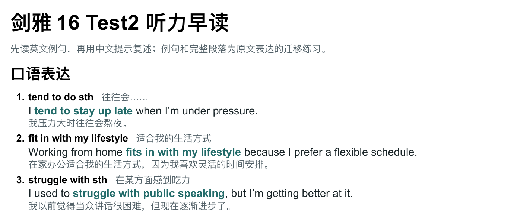

# IELTS Listening Lift

**Turn a listening transcript into language you can practise aloud and reuse.**

[中文](README.md) · English

A Codex skill that turns supplied IELTS Listening Part 1–4 transcripts into bilingual English–Chinese study handouts. **Word first, Markdown when needed.** The content changes with each transcript; the compact reading format stays consistent.



*A crop of the generated C16 Test2 example.* [Read the full Markdown](examples/c16-test2.md) · [Download Word](examples/c16-test2.docx)

## Start with one request

After installation, paste or attach your transcript in Codex:

> Use `$ielts-listening-lift` to turn this IELTS transcript into a bilingual morning-reading handout. Prefer Word and keep the five-section structure. Let the source determine the content; retain useful items when tightening the layout.

A single Part works too. Add “Markdown this time” to choose MD. A later request to tighten spacing updates the existing material without selecting a new set of expressions.

## What each handout contains

| Section | Learning material |
| --- | --- |
| Speaking expressions | Reusable phrases, Chinese meanings, examples and translations |
| Reading and writing collocations | Natural word combinations in transferable contexts |
| N sentence patterns | Useful structures selected from the current transcript |
| Complete responses | Coherent speaking answers or writing paragraphs, with translations |
| Usage notes | Pattern guidance, easily misread expressions and usage boundaries |

Each section starts at **1.**, as do the three usage-note subsections. N is the actual number of patterns, **not a fixed quota of eight**. There is no fixed item count or four-page limit.

## Keep the material, improve the reading

- **“Looks too long” starts a layout revision.** Tighten spacing, remove repeated explanations and improve page breaks. Reduce learning content only when requested.
- **Read each item as a unit.** Expression and meaning share a line; the English example and Chinese translation follow directly. Target phrases use bold teal emphasis.
- **Bring numbers closer.** Native Word lists use a default 4 pt gap, with continuation lines aligned to the text.
- **Let the source guide selection.** Distinguish source language from adaptations, retain uncertainty and usage limits, and avoid padding the pattern section with basic connectors or ornate structures.

## Install in Codex

Download or clone the whole repository locally. The repository root is the skill directory and contains `SKILL.md`.

On macOS / Linux, run this from the repository root. It stops if the destination already exists, preserving local changes.

```bash
skill_root="${CODEX_HOME:-$HOME/.codex}/skills"
mkdir -p "$skill_root"
if [ -e "$skill_root/ielts-listening-lift" ]; then
  echo "Destination exists; inspect the installed version first."
else
  mkdir "$skill_root/ielts-listening-lift"
  cp -R SKILL.md agents scripts references examples assets tests requirements.txt \
    "$skill_root/ielts-listening-lift/"
fi
```

On Windows, copy the same files to `%USERPROFILE%\.codex\skills\ielts-listening-lift`, or the `skills` directory under your configured `CODEX_HOME`. Refresh the skill list or reopen Codex, then invoke `$ielts-listening-lift`.

## Choosing Word or Markdown

Word is preferred. A reusable renderer handles the formatting, so the agent does not need to write layout code for every transcript. Choose Markdown when requested or when the budget or environment makes Word impractical; the agent explains the choice.

**Changing format preserves the content.** Both outputs share one learning-data file. Markdown preserves headings, numbering, emphasis and bilingual line breaks; fonts, colours and pagination depend on the viewer. The skill does not claim to measure inaccessible token usage.

Word generation requires **Python 3.10+**, `python-docx` and an installed Chinese font. Markdown needs only the Python standard library. Word visual QA also needs a document renderer. Use the bundled Codex runtime when available, or install the dependency in an isolated Python environment:

```bash
python3 -m pip install -r requirements.txt
```

## Reproduce the example

Codex selects and writes the learning content before the script formats it. The script accepts reviewed JSON; **it does not analyse a raw transcript by itself**.

```bash
python3 scripts/build_reader.py examples/c16-test2.json \
  --output outputs/c16-test2 --format both \
  --break-before collocations --break-before passages

python3 -m unittest discover -s tests -v
```

The example contains 13 speaking expressions, 17 collocations, 8 patterns, 2 complete responses and three groups of notes. These counts describe the example, not future selection quotas. Its Word output rendered as four pages in the macOS environment used for this version; fonts and editors can change pagination.

[Selection guide](references/content-guide.md) · [Data format and options](references/data-format.md) · [Layout and QA](references/layout-and-qa.md)

<details>
<summary>Files and common questions</summary>

```text
SKILL.md                  Skill entry point
agents/openai.yaml        Codex display metadata and invocation prompt
scripts/build_reader.py   Shared Word / Markdown renderer
references/               Selection, schema, layout and QA guidance
examples/                 C16 Test2 data and both output formats
assets/readme/            Actual document preview
tests/                    Content, numbering and fallback checks
```

**Why might Word show black squares or blue arrows?**

These may be nonprinting formatting marks. Toggle Show/Hide ¶ in Word or WPS. Keep the pagination settings that hold examples and translations together.

**Why are Chinese characters appearing as boxes?**

Check the installed fonts and use `--cjk-font` if needed. Defaults are PingFang SC on macOS, Microsoft YaHei on Windows and Noto Sans CJK SC elsewhere. The repository contains no fonts, and the script does not install them.

**Is the example official exam material?**

No. It is a learning handout derived from user-supplied C16 Test2 material, with adapted examples and short source anchors. The repository does not distribute the full exam transcript and is not affiliated with Cambridge or IELTS.

</details>
